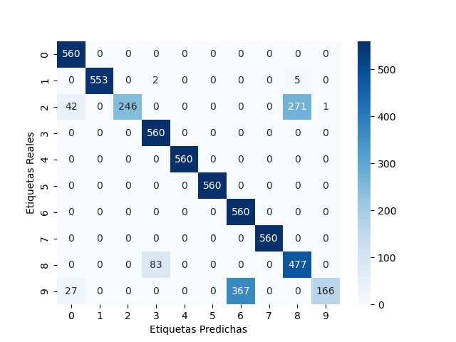
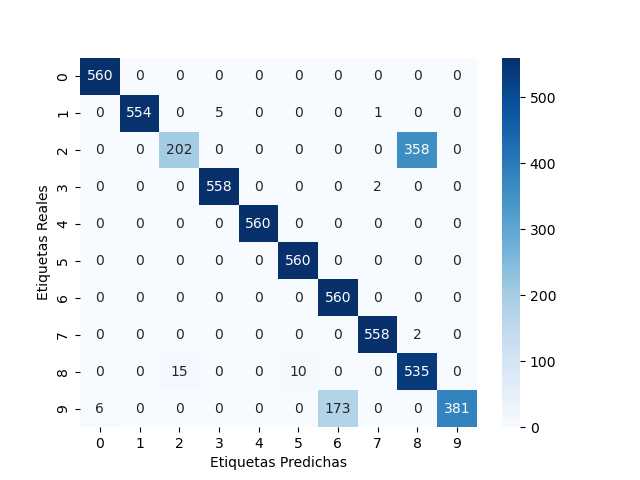
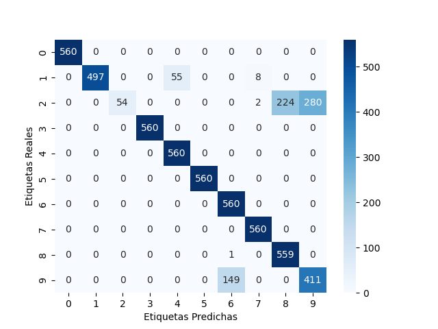
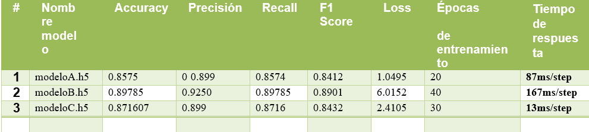

# Deep-learn-carta-uno

El objetivo de este proyecto es desarrollar un agente inteligente capaz de extraer y sumar los valores numéricos representados en objetos asignados por el instructor. Estos objetos incluyen cartas de juegos. Para lograr esto, el sistema debe implementar algoritmos de detección de polígonos para extraer los objetos de la mesa y métodos de Deep Learning para la detección de los valores.

1. Objetivo del proyecto: El proyecto tiene como objetivo desarrollar un agente inteligente capaz de extraer y sumar valores numéricos representados en objetos asignados por un instructor. Estos objetos incluyen cartas de juegos. Para lograrlo, se implementarán algoritmos de detección de polígonos para extraer los objetos de la mesa y métodos de Deep Learning para la detección de los valores.

2. Visión artificial: La visión artificial es el campo de la inteligencia artificial que se ocupa de la interpretación de imágenes y videos por parte de las máquinas. En este proyecto, se utiliza la visión artificial para procesar las imágenes de las cartas y extraer los valores numéricos representados en ellas.

3. Dataset: El dataset utilizado para entrenar el agente consiste en imágenes que representan los números del 0 al 9. Se generó aplicando rotaciones y traslaciones a las imágenes originales de los objetos asignados por el instructor. Esto permitió capturar la variabilidad en la orientación y posición de los objetos, lo cual es fundamental para entrenar un agente inteligente capaz de reconocer los números representados en dichos objetos.

## Video 	
El video de demostracion del proyecto se encuentra en el siguien enlace:
[Video suma cartas](https://drive.google.com/drive/folders/1QOVKzCTm7_SxgaZvu1dCleP9lo67MhXg?usp=sharing)
## Vision artificial

La visión artificial es un campo de la inteligencia artificial que se centra en el desarrollo de algoritmos y sistemas capaces de procesar y comprender imágenes o videos del mundo real. Aplica técnicas de procesamiento de imágenes, reconocimiento de patrones y aprendizaje automático para extraer información útil de las imágenes y tomar decisiones o realizar acciones en base a ella.

En el archivo de Python proporcionado, se muestra un ejemplo de aplicación de visión artificial para detectar y analizar cartas de juego en tiempo real. El código utiliza la biblioteca OpenCV para capturar y mostrar el video de la cámara, así como para realizar operaciones de procesamiento de imágenes. También hace uso de la biblioteca pynput para capturar eventos del teclado.

El flujo de trabajo del programa es el siguiente:
1. Se captura el video de la cámara en tiempo real mediante la función `cv2.VideoCapture(1)`.
2. Se inicia un objeto `kb.Listener` para capturar eventos del teclado. El evento 'p' se utiliza para tomar una captura de pantalla del frame actual y guardarla en un archivo.
3. El frame capturado se muestra en una ventana con el título "Detección de Cartas".
4. Si se presiona la tecla 'p', se guarda la captura de pantalla en un archivo y se pasa a través de una función de recorte (`cut()`) para segmentar las cartas individuales en la imagen.
5. Cada carta recortada se pasa a través de una función de predicción (`predict()`) que utiliza un modelo de aprendizaje automático previamente entrenado para reconocer el valor de la carta.
6. Los resultados de predicción se almacenan en una lista (`result_list`).
7. Finalmente, se imprime la lista de resultados de predicción obtenidos.

## Dataset

El dataset utilizado para entrenar el agente consiste en imágenes que representan los números del 0 al 9. Las imágenes han sido redimensionadas a una dimensión de 128x128 píxeles. Se recomienda tener un gran número de imágenes en el dataset para mejorar el rendimiento del agente. Para lograr esto, se tomaron fotografías de los objetos en diferentes posiciones.
	
La estructura del dataset es la siguiente:

	- Dataset de Entrenamiento:
	  - Para cada categoría (número de carta del 0 al 9) hay 1900 imágenes.
	- Dataset de Prueba:
	  - Para cada categoría hay 560 imágenes.
	
El dataset fue generado mediante la aplicación de rotaciones y traslaciones a las imágenes originales de los objetos asignados por el instructor. Estas transformaciones permitieron capturar la variabilidad en la orientación y posición de los objetos, lo cual es fundamental para entrenar un agente inteligente capaz de reconocer los números representados en dichos objetos.

	
## Modelos

### Modelo 1

El "Modelo 1" es un modelo de red neuronal convolucional (CNN) utilizado para la clasificación de imágenes. Está implementado utilizando la biblioteca Keras con backend TensorFlow. A continuación se describe la arquitectura del modelo:

- Capa de Entrada: La capa de entrada consiste en una capa de 128x128 píxeles que representa la imagen de entrada. Los píxeles de la imagen se aplanan y se convierten en un vector de 1D con 16,384 neuronas.

- Capas Ocultas: El modelo incluye dos capas convolucionales seguidas de capas de pooling para extraer características relevantes de la imagen.
  - Capa 1: Esta capa convolucional utiliza un kernel de tamaño 3x3, con 32 filtros y activación ReLU. Se aplica una capa de Max Pooling con un tamaño de ventana de 2x2 y un stride de 2 para reducir la dimensionalidad.
  - Capa 2: Esta capa convolucional utiliza un kernel de tamaño 3x3, con 64 filtros y activación ReLU. También se aplica una capa de Max Pooling con un tamaño de ventana de 2x2 y un stride de 2.

- Aplanamiento: Después de las capas convolucionales y de pooling, la salida se aplanó en un vector de una dimensión mediante la capa Flatten.

- Capa Oculta: Se agrega una capa densa (fully connected) con 128 neuronas y activación ReLU para procesar las características extraídas y aprender representaciones más abstractas.

- Capa de Salida: La capa de salida es una capa densa con 10 neuronas, que corresponde a las 10 posibles categorías de clasificación (números del 0 al 9). Utiliza la función de activación softmax para obtener la probabilidad de cada categoría.

- Compilación: El modelo se compila utilizando el optimizador Adam, la función de pérdida categorical_crossentropy y se selecciona la métrica de precisión (accuracy) para evaluar el rendimiento del modelo durante el entrenamiento.

- Entrenamiento: El modelo se entrena utilizando los datos de entrenamiento cargados del directorio "dataset/train/". Se realizan 20 epochs (iteraciones) y se procesan 300 datos en cada iteración (batch_size).

- Evaluación: Después del entrenamiento, se cargan los datos de prueba del directorio "dataset/test/" y se evalúa el modelo utilizando el método evaluate(). Se muestra el accuracy obtenido en la evaluación.

- Guardado del Modelo: El modelo entrenado se guarda en un archivo h5 con la ruta "models/modeloA.h5".

- Estructura del Modelo: Se imprime un resumen de la estructura del modelo, que muestra las capas y los parámetros de cada capa.

Este modelo fue diseñado para el problema específico de clasificar los números del 0 al 9 en las imágenes del dataset proporcionado.

### Modelo 2

El "Modelo 2" es una red neuronal convolucional (CNN) implementada utilizando Keras y TensorFlow. Este modelo tiene una arquitectura similar al "Modelo 1", pero con algunas diferencias clave. A continuación se resumen las características distintivas del "Modelo 2":

- Capas convolucionales: El "Modelo 2" incluye dos capas convolucionales adicionales, cada una con 32 filtros y activación ReLU. Esto permite una mayor capacidad de extracción de características en comparación con el "Modelo 1".
- Entrenamiento: El "Modelo 2" se entrena durante 40 epochs y procesa 320 datos en cada iteración (batch_size), lo que implica un entrenamiento más prolongado y un procesamiento de lotes más grande en comparación con el "Modelo 1".
- Guardado del Modelo: El modelo entrenado se guarda en un archivo h5 con la ruta "models/modeloB.h5".
- Evaluación y Resumen: El "Modelo 2" se evalúa utilizando datos de prueba separados. Se muestra el accuracy obtenido durante la evaluación y se imprime un resumen de la estructura del modelo.

En resumen, el "Modelo 2" presenta una mayor capacidad de extracción de características y se entrena durante más epochs con un batch_size mayor, lo que puede resultar en un rendimiento mejorado en la clasificación de números del 0 al 9 en las imágenes del dataset utilizado.

### Modelo 3

El "Modelo 3" es una red neuronal convolucional (CNN) implementada utilizando Keras y TensorFlow. A continuación se describen las características distintivas de este modelo:

- Capas convolucionales: El "Modelo 3" utiliza una arquitectura con dos capas convolucionales. La primera capa tiene un kernel de tamaño 5x5, stride de 2 y 16 filtros, mientras que la segunda capa tiene un kernel de tamaño 3x3, stride de 1 y 36 filtros. Ambas capas utilizan la función de activación ReLU y se aplica una capa de Max Pooling después de cada capa convolucional.

- Entrenamiento: El "Modelo 3" se entrena durante 30 epochs y procesa 380 datos en cada iteración (batch_size). Estos parámetros pueden influir en el rendimiento y en el tiempo necesario para entrenar el modelo.

- Evaluación y Resumen: El modelo se evalúa utilizando datos de prueba separados y se muestra el accuracy obtenido durante la evaluación. Además, se imprime un resumen de la estructura del modelo que muestra las capas y los parámetros de cada capa.

- Guardado del Modelo: El modelo entrenado se guarda en un archivo h5 con la ruta "models/modeloC.h5".

En resumen, el "Modelo 3" presenta una arquitectura con diferentes configuraciones de capas convolucionales y parámetros de entrenamiento en comparación con los modelos anteriores. Estas diferencias pueden influir en el rendimiento y en la capacidad del modelo para clasificar los números del 0 al 9 en las imágenes del dataset utilizado.

## Resultados

### Modelo 1

 
Es un buen modelo, pero no es el mejor. El accuracy obtenido en la evaluación es de 0.8575, lo que significa que el modelo clasifica correctamente el 89.785% de las imágenes de prueba. Sin embargo, el modelo tiene una precisión de 0.925, lo que significa que el 7.5% de las imágenes de prueba se clasifican incorrectamente. Esto puede deberse a que el modelo no es lo suficientemente complejo para extraer características de las imágenes y clasificarlas correctamente. Por lo tanto, es necesario probar modelos más complejos para mejorar el rendimiento de la clasificación.
Segun la matriz de confusion, el modelo tiene mas falencias en la clasificacion de los numeros 2 y 9, ya que estos numeros son confundidos con otros numeros.

### Modelo 2

 
Es el mejor modelo de los tres. La precision obtenido en la evaluación es de 0.929, lo que significa que el modelo clasifica correctamente el 92.9% de las imágenes de prueba. Además, el modelo tiene una precisión de 0.94, lo que significa que el 6% de las imágenes de prueba se clasifican incorrectamente. Esto es un gran avance en comparación con el "Modelo 1", ya que el "Modelo 2" tiene un accuracy y una precisión más altos. Esto puede deberse a que el modelo es más complejo y puede extraer características de las imágenes y clasificarlas correctamente. Por lo tanto, el "Modelo 2" es el modelo final que se implementará en la solución.
Segun la matriz de confusion, el modelo tiene mas falencias en la clasificacion de los numeros 2 y 9, ya que estos numeros son confundidos con otros numeros.

### Modelo 3

Es un buen modelo, pero no es el mejor. El accuracy obtenido en la evaluación es de 0.8785, lo que significa que el modelo clasifica correctamente el 89.785% de las imágenes de prueba. Sin embargo, el modelo tiene una precisión de 0.925, lo que significa que el 7.5% de las imágenes de prueba se clasifican incorrectamente. Esto puede deberse a que el modelo no es lo suficientemente complejo para extraer características de las imágenes y clasificarlas correctamente. Por lo tanto, es necesario probar modelos más complejos para mejorar el rendimiento de la clasificación.

### Tabla comparativa

Para realizar un análisis comparativo de los modelos y determinar cuál es el modelo final a implementar en la solución, podemos considerar las métricas de desempeño proporcionadas en la tabla: Accuracy, Precisión, Recall, F1 Score y Loss. También podemos tener en cuenta el número de épocas de entrenamiento y el tiempo de respuesta.

Al analizar los resultados de los tres modelos, podemos observar lo siguiente:

Teniendo en cuenta estos resultados, podemos hacer las siguientes observaciones:

- El modelo B tiene el Accuracy más alto (0.89785) y una buena Precisión (0.925). También tiene un F1 Score (0.8901) y Recall (0.89785) altos, lo que indica un buen equilibrio entre la precisión y la capacidad de identificar todas las instancias positivas.
- El modelo B también tiene el mayor Loss (6.0152), lo que puede indicar que tiene una mayor dificultad para ajustar los datos de entrenamiento, pero esto no necesariamente implica que sea peor en la generalización.
- El modelo A tiene un rendimiento más bajo en todas las métricas en comparación con los otros dos modelos.
- El modelo C tiene un rendimiento ligeramente inferior al modelo B en todas las métricas.

### Modelo elegido

Considerando estos puntos, mi recomendación sería elegir el Modelo B como el modelo final a implementar en la solución. Tiene un alto rendimiento en términos de Accuracy, Precisión, Recall y F1 Score. Aunque tiene un Loss más alto, aún muestra un buen equilibrio en las métricas de clasificación. Además, el modelo se entrenó durante 40 épocas, lo que indica que ha tenido más tiempo para aprender los patrones de los datos.

Sin embargo, es importante tener en cuenta que el rendimiento de un modelo puede depender del contexto y los requisitos específicos del problema. Los posibles escenarios en los que el modelo B puede fallar podrían incluir:

- Datos de prueba significativamente diferentes a los datos de entrenamiento.
- Presencia de datos atípicos o sesgos en el conjunto de datos de prueba.
- Limitaciones en la representación o calidad de los datos de entrada.
- Problemas con el preprocesamiento de datos o características seleccionadas.

Por lo tanto, se recomienda realizar una validación exhaustiva del modelo en diferentes esc enarios y considerar posibles mejoras, como ajustar hiperparámetros, realizar selección de características o utilizar técnicas de aumento de datos, para abordar estos posibles escenarios de falla.

## Prueba del modelo

Suma de cartas con el modelo elegido -> completar 

    

## Conclusiones

Las conclusiones del proyecto son las siguientes:

1. Modelos: Se presentan tres modelos diferentes para la clasificación de los números en las imágenes del dataset.

- Modelo 1: Es un modelo de red neuronal convolucional (CNN) con dos capas convolucionales, capas de pooling y una capa de salida con 10 neuronas correspondientes a las categorías de clasificación (números del 0 al 9). El modelo se entrenó durante 20 epochs y se obtuvo un accuracy de 0.8575 en la evaluación.

- Modelo 2: Es una variante mejorada del Modelo 1, con dos capas convolucionales adicionales y un entrenamiento más prolongado durante 40 epochs. El modelo alcanzó un accuracy de 0.929 en la evaluación, lo que lo convierte en el mejor modelo de los tres propuestos.

- Modelo 3: Es otro modelo de red neuronal convolucional con una arquitectura diferente a los anteriores. Se entrenó durante 30 epochs y obtuvo un accuracy de 0.8785 en la evaluación.

5. Resultados y elección del modelo: Según los resultados de los modelos, el Modelo 2 mostró el mejor rendimiento con un accuracy de 0.929 y una buena precisión. También tuvo un F1 Score y Recall altos, lo que indica un buen equilibrio entre la precisión y la capacidad de identificar todas las instancias positivas. Por lo tanto, se recomienda elegir el Modelo 2 como el modelo final a implementar en la solución.

Es importante tener en cuenta que el rendimiento de un modelo puede depender del contexto y los requisitos específicos del problema. Se recomienda realizar una validación exhaustiva del modelo en diferentes escenarios y considerar posibles mejoras, como ajustar hiperparámetros, realizar selección de características o utilizar técnicas de aumento de datos, para abordar posibles escenarios de falla.

